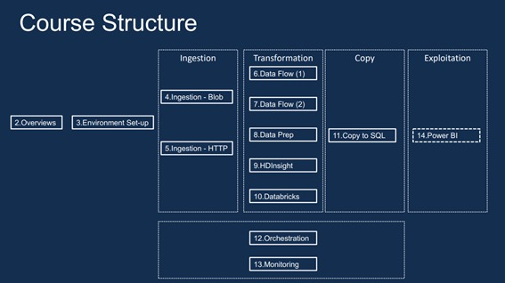
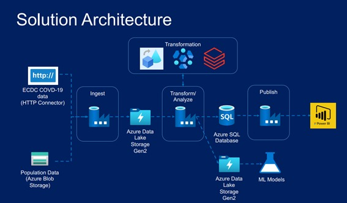

# Azure Data Factory for Data Engineers - Project Covid 19

## Sobre o curso

### Objetivo
O objetivo deste recurso é realizar uma demonstração de um case real de dados utilizando as principais ferramentas da Cloud da Microsoft (Azure) e como elas se integram, sendo focado principalmente em Azure Data Factory (ADF), responsável pela ingestão e orquestração dos dados.

### Sobre o Autor

O repositório original pertence ao professor Ramesh Retnasamy no qual é especialista em Arquitetura, Design, Desenvolvimento e Implementação de projetos de engenharia de dados e machine learning, atuando com Tecnologia da Informação desde 2002. 

LinkedIn: https://www.linkedin.com/in/ramesh-retnasamy/

### Adquirindo o curso

O curso pode ser adquirido em: https://www.udemy.com/course/learn-azure-data-factory-from-scratch/

## O que é abordado

Os principais aprendizados técnicos podem ser categorizados pela operacionalização das ferramentas Azure Data Factory (ADF), Azure Storage Solutions, Azure HDInsight & Datarbricks.

### Azure Data Factory

Principal ferramenta em cloud da Microsoft utilizada para tarefas de obtenção, ingestão e orquestração de dados. 

- Realização de integração de dados via http, blog storage e data lake gen2, activies como get metadata, if, ForEach, Remoção, validação. 
- Utilização de parâmetros e variáveis em pipelines, criação e configuração de datasets e linkedservices para criação de metadados. 
- Operações de debug, agendamentos por event trigger, schedule trigger e tumbling window trigger. 
- Integração e orquestração com Databricks e HDInsight, Orquestração de todas as activites via pipeline. 
- Aplicação do log analytics workspace para monitoramento das atividades

### Azure Storage Solutions

Ferramentas em cloud da Microsoft utilizadas para armazenamento de arquivos, controle de acessos e centralização de informações.

- Criação e provisionamento de Storage Account, Containers, Upload de dados, IAM e utilização do Azure Storage Explorer. 
- Criação de Data Lake Gen2, Conainers, Upload de dados, IAM. 
- Criação de Azure SQL Database, valores, usuário administrador, criação de tabelas, carga de dados e queries.

### Azure HDinsight & Databricks

Ferramentas utilizadas para processamentos de grandes volumes de dados, no qual apenas o Data Factory não seria capaz de realizar os devidos tratamentos.

- Criação de clusters em HDInsight, interação via UI, utilização de tabelas em Hive, requição das activities via data factory.
- Criação de Workspace no Azure Databricks, criação de Clusters, realizando operações de mount em storage account, criação de notebooks, transformações via pyspark, requisição dos notebooks via ADF.

## Estruturação do curso/projeto

O projeto é aplicado desde a obtenção dos dados do Covid 19 até a sua entrega de maneira estruturada, sendo possível o consumo por analistas de bi, cientistas de dados e até mesmo outros engenheiros de dados. Abaixo, pode-se observar os módulos, fontes de dados e arquitetura utilizada.

### Módulos

  

- Módulo 1 - Aspectos gerais.
- Módulo 2 - Overview Geral.
- Módulo 3 – Configuração de ambiente, sendo desde a criação de uma conta free na azure como provisionamento de ambientes, bem como seus conceitos.
- Módulo 4 – Ingestão de dados em um blob storage.
- Módulo 5 – Ingestão de dados de origem HTTP.
- Módulo 6 – Visão geral sobre o data flow e suas limitações, e Realização de processos de ETL utilizando o Data Flow do Azure Data Factory.
- Módulo 7 – Realizando processos de ETL mais complexos utilizando o Data Flow.
- Módulo 8 – Realizando a preparação dos dados.
- Módulo 9 – Conhecendo sobre o HDInsight (provisionamento, aplicação, agendamentos).
- Módulo 10 – Visão geral sobre o databricks, composição de um cluster em driver e worker nodes, e realização do processamento através do Databricks.
- Módulo 11 – Realizando a ingestão em um SQL Database provisionado em cloud.
- Módulo 12 – Realizando a orquestração dos processos via pipeline utilizando as possibilidades, de parente pipeline e trigger dependency.
- Módulo 13 – Realizando o monitoramento das triggers e pipelines bem como apresentação da ferramenta Log Analytics.
- Módulo 14 – Realizando a extração de insights através do Power BI.

### Fontes de dados

As fontes dos dados são da **ECDC** contendo informações de casos confirmados, óbitos, hospitalizações e números de testes realizados e **European Statistical System** contendo informações gerais sobre a população.

### Arquitetura proposta

  

